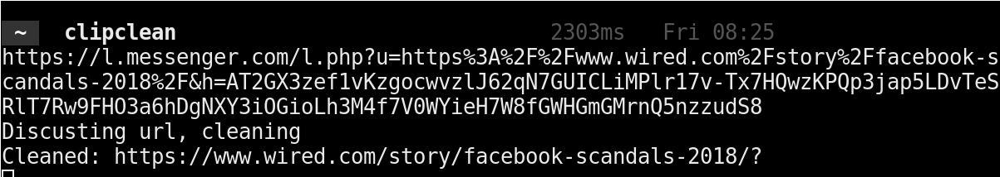

# clipclean

Removes the tracking part of links you have put in your clipboard (Copy-Pasting), very useful when you
want to forward that link you got from a messenger, or youtube chat to another application or to paste it
into a word document.

## Example

When copying a link without clipclean from a facebook messenger chat, something like this is what
will end up in your clipboard:

    https://l.messenger.com/l.php?u=https%3A%2F%2Fwww.wired.com%2Fstory%2Ffacebook-scandals-2018%2F&h=AT2BKvc_VxdVhNxWsy6bFRdbp15GPkOCk2MMWqqDnw4tQx1pe3gGVwvkN1GmuZ5se0zp1DZSrx0JK1JgvwBseu0_rOav1U1T41vR6WhnwYgszi79iJv-rqetVWQ

When using clipclean, the true target will be what is stored in your clipboard,
and will basically make the link look a lot more trustworthy, wherever it will end up. The below link
is the same site that the above link will take you to, just that facebook will not know that it was
originally from one of their chats.

    https://www.wired.com/story/facebook-scandals-2018/?

## Installation and running

This assumes that cargo is installed on your system, and in your path, as well as the cargo binary
folder is in your path.

    cargo install clipclean
    clipclean

### Windows

    cargo install --no-default-features clipclean

